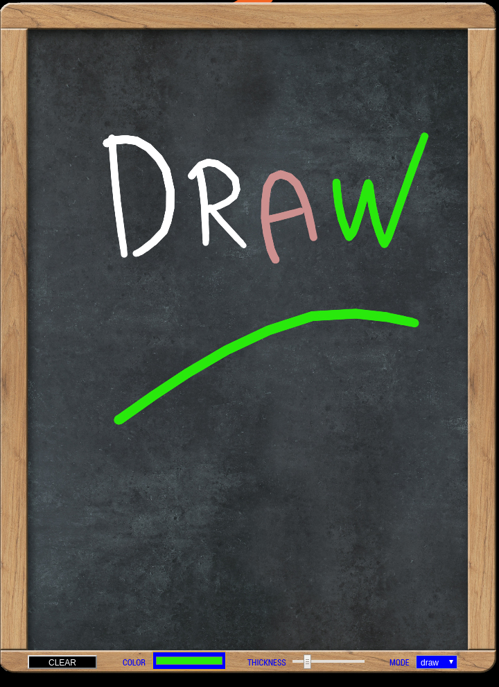

# MMM-rdrDrawingBoard
rafHTL
This is a module for the MagicMirror².



## Installing the module

To install the module, assuming you have MagicMirror installed with the default configuration:

cd ~/MagicMirror/modules

git clone https://github.com/rafhtl/MMM-rdrDrawingBoard.git

## Using the module

To use this module, add the following configuration block to the modules array in the config/config.js file:
```
{
        module: 'MMM-rdrDrawingBoard',
        position: 'fullscreen_below',
        config: {
            width: "900px", // 'px' or '%' or valid value for CSS dimensions units. "900px" portrait - "995px" landscape
            height: "630px", // these have to be the same as .MMM-rdrDrawingBoard .canvas "630px" portrait - 565px landscape
            lineColor: "#FFFFFF",
            lineSize: 7,
            orientation: "portrait", //landscape or portrait
            smoothing: 0.55, //tweak smoothing - higher values make the drawings look much better, lower values make drawing feel a bit more responsive. Set to 0.85 by default.
            mode: "draw", //draw, fill
            imgfileUrl: "modules/MMM-rdrDrawingBoard/public/blackboard01.png" //background

            

           }
    },
   ```

Please note that the portrait css is based on vertical rotation (custom.css) NOT screen rotation (config.txt)

```
body {
	margin: 0;
	position: absolute;
 	transform: rotate(-90deg);
 	transform-origin: top left; 
	width: 100vh;
	height: 100vw;
	object-fit: cover;
	top: 100vh;
    visibility: visible;  
    
    
 }
```
 
you can change this to horizontal by  specifying orientation: "landscape" and using the css MMM-rdrDrawingBoard_landscape.css. Please share your design, thank you.

thank you Philip Sturgeon for atrament.js original code.